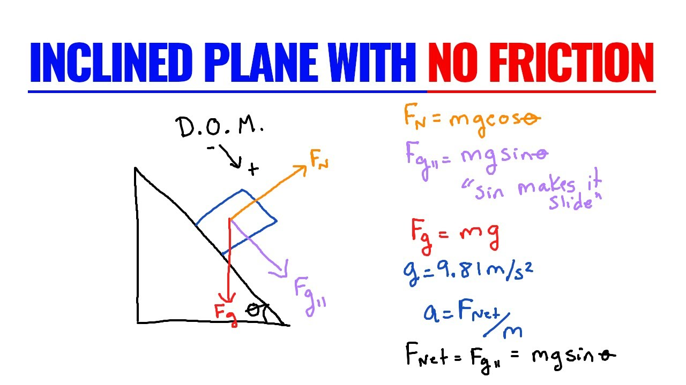
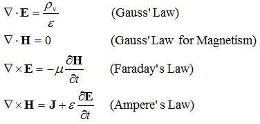

# Roadmap Electrical Engineering

## 0. Base knowledge

If you find this kind of problem intimidating, then you're not ready to be an electrical engineer... yet. Before jumping into EE, you need to become an engineer. An engineer is a problem solver, who breaks down complex problems into smaller easier tasks. Classical mechanics is a great way to practise your engineering skills. It teaches you what you do/don't know, what variable you're trying to solve for, what conditions are implied etc. 

## 1. Technical Skills

### a. Basic knowledge
#### i. Electromagnetic Theory

You can think of the RHS as the cause and the LHS as the effect. 

Gauss' law: If I have a charge, then that charge is going to exert an electric field.

Gauss' law for magnetism: A magnetic field can't be caused on its own.

Faraday's law: By changing a magnetic field, I can induce an electric field.

Ampere's law: By changing an electric field or passing current, I can induce a magnetic field.

#### ii. Circuit Theory

### b. Basic software
MATLAB, Python, C/C++

### c. Software by subfield
#### 1. Electronics (LTSpice, Arduino, KiCAD, Altium)
#### 2. Software (Python(Jupyter), C/C++)
#### 3. Telecommunications/Signal Processing (Matlab, Python, C/C++)
#### 4. Antennas/RF (ANSYS HFSS, Microwave CST, Altair FEKO, Comsol)
#### 5. Embeddded Systems (Arduino)
#### 6. Microelectronics/VLSI (VHDL, Verilog)

## 2. Soft skills
### a. Critical thinking
### b. Problem solving
### c. Communication
### d. Opportunity detection
### e. Tenactiy/High pain tolerance

## 3. How to learn technical skills
### a. Pick a project
### b. Join a club/team
### c. Internship

## 4. How to learn soft skills
### a. Talk to people
### b. Put yourself in uncomfortable situations
### c. Always ask why
### d. Read books

## 5. How to showcase your skills
### a. Resume
Here you need to really flatter yourself, no one is going to do it for you. A resume allows you to summarize who you are, to showcase your experiences and your skills. You can use this resume template [Resume Template](https://github.com/nathanhiruy/Resume-Template)

### b. LinkedIn

Inspired by Ali the Dazzling's "Most Important Skills for Electrical Engineering"
